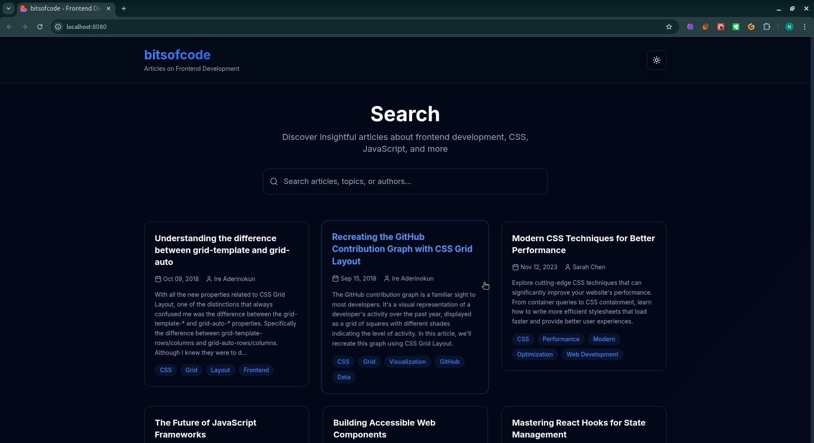

# Bits Of Code: Illuminated Texts

A modern, accessible search interface for frontend development articles. Built with React, TypeScript, and Vite, featuring a beautiful UI with dark mode support and social sharing capabilities.



## 🚀 Features

- **Real-time Search**: Instant filtering of articles as you type
- **Search Highlighting**: Keywords are highlighted in yellow across titles, content, and tags
- **Light/Dark Theme**: Toggle between themes with smooth transitions
- **Article Detail View**: Click articles to read full content with elegant slide-in animations
- **Responsive Design**: Works beautifully on desktop, tablet, and mobile
- **Professional UI**: Modern design with subtle gradients and hover effects
- **Smooth Animations**: Fade-in effects, scale transforms, and micro-interactions

## 🛠️ Technologies Used

- **React 18** with TypeScript
- **Tailwind CSS** for styling and animations
- **Lucide React** for beautiful icons
- **Vite** for fast development and building
- **shadcn/ui** component library foundation

## 🎨 Design Features

- **Futuristic Theme**: Clean, modern interface with subtle gradients
- **Professional Color Palette**: Blue accents with careful contrast ratios
- **Smooth Transitions**: All interactions include thoughtful animations
- **Responsive Grid**: Articles display in an adaptive grid layout
- **Typography**: Uses Inter font for excellent readability

## 📦 Getting Started

### Prerequisites

- Node.js (v18 or higher)
- npm, yarn, or pnpm

### Installation

1. Clone the repository:
```bash
git clone https://github.com/naveed-gung/Bits-Of-Code
cd glowsearch-illuminated-texts-main
```

2. Install dependencies:
```bash
# Using npm
npm install

# Using yarn
yarn install

# Using pnpm
pnpm install
```

3. Start the development server:
```bash
# Using npm
npm run dev

# Using yarn
yarn dev

# Using pnpm
pnpm dev
```

4. Open your browser and navigate to `http://localhost:5173`

### Environment Setup

Create a `.env` file in the root directory:
```bash
# .env
VITE_APP_TITLE="GlowSearch"
VITE_APP_DESCRIPTION="Illuminated Texts - Frontend Development Articles"
```

For development, you can create a `.env.development` file:
```bash
VITE_APP_API_URL="http://localhost:5173"
VITE_APP_DEBUG=true
```

### Building for Production

```bash
# Build the application
npm run build
# or
yarn build
# or
pnpm build

# Preview the production build
npm run preview
# or
yarn preview
# or
pnpm preview
```

## 🔍 How to Use

1. **Search**: Type keywords in the search box to filter articles
2. **View Results**: See matching articles with highlighted search terms
3. **Read Articles**: Click any article card to view the full content
4. **Toggle Theme**: Use the theme toggle button in the top-right corner
5. **Clear Search**: Click "Clear search" or clear the search box to see all articles

## 📁 Project Structure

```
src/
├── components/                # React components
│   ├── ui/                   # shadcn/ui components
│   ├── SearchBox.tsx         # Search input component
│   ├── ArticleCard.tsx       # Article preview cards
│   ├── ArticleDetail.tsx     # Full article modal view
│   ├── ShareButton.tsx       # Social sharing component
│   └── ThemeToggle.tsx       # Light/dark theme switcher
├── data/
│   └── articles.ts           # Static article data and types
├── hooks/                    # Custom React hooks
│   ├── use-mobile.tsx       # Mobile detection hook
│   └── use-toast.ts         # Toast notifications hook
├── lib/
│   └── utils.ts             # Utility functions
├── pages/
│   ├── Index.tsx            # Main application page
│   └── NotFound.tsx         # 404 page
└── App.tsx                  # Root application component
```

## 🎯 Key Features Implementation

### Search & Highlighting
- Real-time filtering using `useMemo` for performance
- Text highlighting with `<mark>` elements
- Search across title, content, excerpt, author, and tags

### Responsive Design
- CSS Grid with responsive breakpoints
- Mobile-first design approach
- Touch-friendly interactive elements

### Performance
- Optimized re-renders with React hooks
- Efficient search algorithms
- Lazy loading of article content

### Accessibility
- Semantic HTML structure
- ARIA labels and roles
- Keyboard navigation support
- High contrast mode support
- Screen reader friendly

### Social Sharing
- Share articles on Twitter and LinkedIn
- Copy article link to clipboard
- Share button with dropdown menu
- URL-based article sharing

## 📝 License

This project is licensed under the MIT License. See the [LICENSE](LICENSE) file for details.

## 🧪 Testing

Run the test suite:
```bash
# Using npm
npm run test

# Using yarn
yarn test

# Using pnpm
pnpm test
```

Run tests in watch mode during development:
```bash
npm run test:watch
```

## 🚀 Deployment

The application can be deployed to various platforms:

### Vercel (Recommended)
1. Push your code to GitHub
2. Import your repository in Vercel
3. Vercel will automatically detect it as a Vite project and configure the build settings

### Manual Deployment
1. Build the application:
```bash
npm run build
```
2. The `dist` folder will contain the built application
3. Deploy the contents of `dist` to your hosting provider

## 🤝 Contributing

1. Fork the repository
2. Create your feature branch (`git checkout -b feature/amazing-feature`)
3. Commit your changes (`git commit -m 'Add some amazing feature'`)
4. Push to the branch (`git push origin feature/amazing-feature`)
5. Open a Pull Request

## 🙏 Acknowledgments

- UI components from [shadcn/ui](https://ui.shadcn.com/)
- Icons by [Lucide](https://lucide.dev/)
- Font by [Inter](https://rsms.me/inter/)
- Inspired by modern documentation sites and search interfaces

## ⚠️ Troubleshooting

### Common Issues

1. **Node Version Mismatch**
   ```bash
   # Check your Node.js version
   node --version
   
   # Use nvm to install the correct version
   nvm install 18
   nvm use 18
   ```

2. **Dependencies Installation Fails**
   - Clear npm cache: `npm cache clean --force`
   - Delete node_modules: `rm -rf node_modules`
   - Delete package-lock.json: `rm package-lock.json`
   - Reinstall dependencies: `npm install`

3. **Vite Build Issues**
   - Clear vite cache: `rm -rf node_modules/.vite`
   - Ensure all TypeScript files are properly typed
   - Check for circular dependencies

4. **Development Server Issues**
   - Check if port 5173 is available
   - Try running with different port: `npm run dev -- --port 3000`

For more issues, please check our [Issues](https://github.com/yourusername/glowsearch-illuminated-texts/issues) page.
- Proper ARIA labels
- Keyboard navigation support
- High contrast ratios

## 🚀 Build for Production

```bash
npm run build
```

The built files will be in the `dist/` directory, ready for deployment.

## 📝 Article Data

The application includes 10 sample articles covering various frontend development topics:
- CSS Grid and Flexbox
- React Hooks and State Management
- TypeScript Best Practices
- Progressive Web Apps
- Code Reviews and Collaboration
- Accessibility in Web Development

## 🎨 Customization

### Adding New Articles
Edit `src/data/articles.ts` to add new articles with the following structure:

```typescript
{
  id: number,
  title: string,
  author: string,
  date: string,
  excerpt: string,
  content: string,
  tags: string[]
}
```

### Styling
- Modify `tailwind.config.ts` for theme customization
- Update CSS custom properties in `src/index.css`
- Adjust animations and transitions in component files

## 🌟 Future Enhancements

- Advanced filtering options (by author, date, tags)
- Search suggestions and autocomplete
- Bookmarking system
- Reading progress indicator
- Social sharing capabilities

## 📄 License

This project is open source and available under the MIT License.
